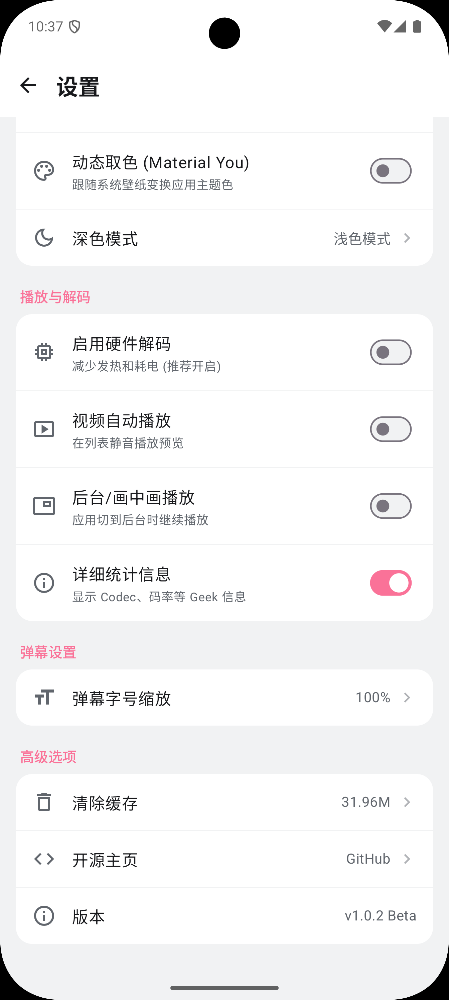

# BiliPai ( ゜- ゜)つロ 干杯~

  
  
  
  

> **"Cheers to the Pure View."**
> 
> BiliPai 是一个基于 **Jetpack Compose** 和 **Material Design 3** 构建的现代化 Bilibili 第三方客户端。
> 我们剔除了所有繁杂的营销功能，只保留最纯粹的视频观看体验。

---

## ✨ 核心特性 (Features)

目前版本 (v1.0 Alpha) 已经支持以下功能：

- **🎨 纯净 UI 设计**：完全遵循 Material Design 3 设计规范，支持动态取色，无广告干扰。
- **📱 沉浸式首页**：采用高性能 `LazyVerticalGrid` 布局，支持下拉刷新，顺滑流畅。
- **🎥 视频播放**：集成基础播放器功能，支持点击封面直接播放。
- **🌗 深色模式**：完美适配系统深色/浅色主题切换。
- **⚙️ 个性化设置**：
  - 支持首页视频自动播放开关。
  - 支持默认高清画质选项。
- **🔐 登录支持**：(开发中) 支持扫码/账号登录以获取个性化推荐。

## 📸 预览 (Screenshots)

| 首页 (Home) | 播放器 (Player) | 个人中心 (Profile) |
|:---:|:---:|:---:|
|  |  |  |
## 🛠 技术栈 (Tech Stack)

本项目完全使用现代 Android 技术栈构建，适合学习和参考：

- **语言**: [Kotlin](https://kotlinlang.org/)
- **UI 框架**: [Jetpack Compose](https://developer.android.com/jetpack/compose) (Material3)
- **架构模式**: MVVM (Model-View-ViewModel)
- **网络请求**: [Retrofit](https://square.github.io/retrofit/) + [OkHttp](https://square.github.io/okhttp/)
- **图片加载**: [Coil](https://coil-kt.github.io/coil/)
- **异步处理**: Coroutines + Flow
- **导航**: Jetpack Navigation Compose
- **依赖注入**: (计划迁移至 Hilt/Koin)

## 🗺️ 开发路线图 (Roadmap)

我们致力于打造最优雅的 B 站客户端，未来计划如下：

### 🚀 短期计划 (v1.x)
- [ ] **弹幕系统**：支持视频弹幕的解析与渲染（核心功能！）。
- [ ] **评论区**：支持查看视频评论与楼中楼。
- [ ] **搜索增强**：增加综合搜索、UP主搜索及搜索建议。
- [ ] **动态页面**：查看关注 UP 主的最新动态。

### 🛠 中期计划 (v2.x)
- [ ] **番剧支持**：独立的番剧索引与播放界面。
- [ ] **直播功能**：观看直播及发送弹幕。
- [ ] **离线缓存**：支持视频下载与离线播放。
- [ ] **Pad 适配**：针对平板设备的大屏 UI 适配。

### 🔮 长期愿景
- [ ] **插件化**：允许用户自定义功能模块。
- [ ] **多平台**：尝试 Compose Multiplatform 移植到 Desktop/iOS。

## 🤝 贡献 (Contributing)

非常欢迎各种形式的贡献！无论是提交 Bug、建议新功能，还是提交 PR。

1. Fork 本仓库
2. 新建你的特性分支 (`git checkout -b feature/AmazingFeature`)
3. 提交更改 (`git commit -m 'Add some AmazingFeature'`)
4. 推送到分支 (`git push origin feature/AmazingFeature`)
5. 提交 Pull Request

## ⚠️ 免责声明 (Disclaimer)

1. 本项目仅供 **学习交流** 使用，旨在演示 Jetpack Compose 在复杂应用中的实践。
2. 本项目 **严禁用于任何商业用途**。
3. 项目中使用的 API 均来源于 Bilibili 官方，所有数据版权归上海幻电信息科技有限公司所有。
4. 如果本项目侵犯了您的权益，请联系作者删除。

---

  Made with ❤️ by YangY 
   
  ( ゜- ゜)つロ 干杯~

git commit -m "Update"
